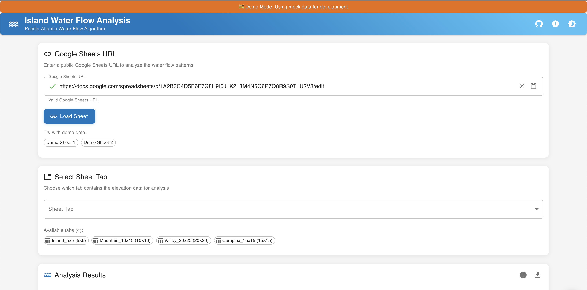
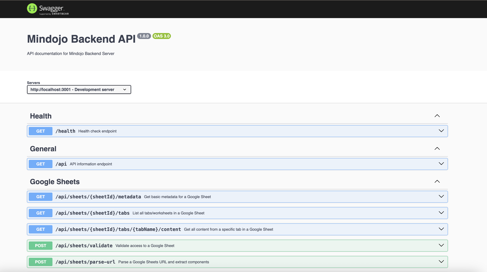
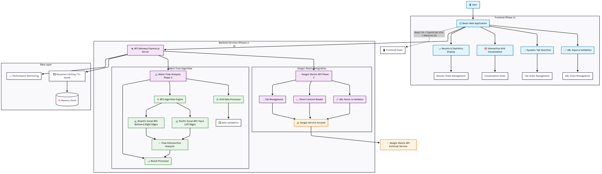

# Mindojo - Island Water Flow Analysis

> ## 🎥 **DEVELOPMENT VIDEO DEMONSTRATION**
> 
> **📹 Watch the complete development walkthrough and feature demonstration:**  
> **[🔗 Development Video - Mindojo Water Flow Analysis](https://www.loom.com/share/4ff17c79566444a79ed2321d06d83292?sid=45c5bd33-f7c7-4018-8591-d381940ca2cb)**
>
> *This video shows the complete end-to-end integration, real Google Sheets data processing, and live water flow analysis in action.*

---

A comprehensive web application for analyzing topographical data and determining optimal water flow patterns on islands using the Pacific-Atlantic water flow algorithm.



## 🌊 Project Overview

Mindojo is a sophisticated full-stack application that analyzes topographical data from Google Sheets to determine which grid cells allow water to flow to both the Pacific Ocean (northwest edges) and Atlantic Ocean (southeast edges). The project implements an optimized BFS algorithm with O(m×n) time complexity, capable of handling large datasets efficiently.

### Key Features

- **🌐 Web Interface**: Modern React + TypeScript frontend with Material-UI components
- **📊 Google Sheets Integration**: Direct integration with Google Sheets for topographical data
- **⚡ Optimized Algorithm**: Pacific-Atlantic water flow analysis with reverse BFS optimization
- **🎯 Interactive Visualization**: Real-time grid visualization with qualifying cell highlighting
- **📚 API Documentation**: Comprehensive Swagger/OpenAPI documentation
- **🚀 Performance**: Handles large grids (1000x1000+) with streaming and caching

## 🔗 Project Resources

- **📋 [Development Tasks & Phases](TASKS.md)** - Complete project roadmap and implementation details
- **🏗️ [System Architecture](ARCHITECTURE.md)** - Detailed technical architecture documentation
- **📺 [Development Process Video](#)** *(Coming Soon)*
- **🔧 [API Documentation](http://localhost:3001/api-docs)** - Interactive Swagger UI
- **🎨 [Live Demo](#)** *(Coming Soon)*

## 📸 Project Screenshots

| Interface            | API Documentation              | Architecture                        |
|----------------------|--------------------------------|-------------------------------------|
|  |  |  |

## 🏗️ System Architecture

```mermaid
graph TB
    %% User Interface Layer
    User[👤 User] --> WebApp[🌐 React Web Application]
    
    %% Frontend Application
    subgraph "Frontend (Phase 4)"
        WebApp --> URLInput[📝 URL Input & Validation]
        WebApp --> TabSelector[📑 Dynamic Tab Selection] 
        WebApp --> GridViz[🎯 Interactive Grid Visualization]
        WebApp --> Results[📊 Results & Statistics Display]
        
        URLInput --> URLState[URL State Management]
        TabSelector --> TabState[Tab State Management]
        GridViz --> VizState[Visualization State]
        Results --> ResultState[Results State Management]
    end
    
    %% API Gateway
    WebApp --> APIGateway[🔌 API Gateway<br/>Express.js Server]
    
    %% Backend Services
    subgraph "Backend Services (Phases 2-3)"
        APIGateway --> SheetsAPI[📈 Google Sheets API<br/>Phase 2]
        APIGateway --> WaterFlowAPI[🌊 Water Flow Analysis<br/>Phase 3]
        
        %% Sheets Service Layer
        subgraph "Google Sheets Integration"
            SheetsAPI --> URLParser[🔗 URL Parser & Validator]
            SheetsAPI --> SheetReader[📖 Sheet Content Reader]
            SheetsAPI --> TabManager[📑 Tab Management]
            URLParser --> GoogleAuth[🔐 Google Service Account]
            SheetReader --> GoogleAuth
            TabManager --> GoogleAuth
        end
        
        %% Water Flow Analysis
        subgraph "Water Flow Algorithm"
            WaterFlowAPI --> GridProcessor[⚙️ Grid Data Processor]
            WaterFlowAPI --> BFSEngine[🧠 BFS Algorithm Engine]
            WaterFlowAPI --> ResultProcessor[📊 Result Processor]
            
            GridProcessor --> DataValidation[✅ Data Validation]
            BFSEngine --> PacificBFS[🌊 Pacific Ocean BFS<br/>Top & Left Edges]
            BFSEngine --> AtlanticBFS[🌊 Atlantic Ocean BFS<br/>Bottom & Right Edges]
            PacificBFS --> Intersection[⚡ Flow Intersection Analysis]
            AtlanticBFS --> Intersection
            Intersection --> ResultProcessor
        end
    end
    
    %% External Services
    GoogleAuth --> GoogleAPI[☁️ Google Sheets API<br/>External Service]
    
    %% Data Storage & Caching
    subgraph "Data Layer"
        APIGateway --> Cache[💾 Response Caching<br/>TTL-based]
        APIGateway --> Monitoring[📈 Performance Monitoring]
        Cache --> MemoryStore[(🧠 Memory Store)]
    end
    
    %% Technology Stack Labels
    WebApp -.->|React 19 + TypeScript<br/>Vite + Material-UI| TechFrontend[📱 Frontend Stack]
    APIGateway -.->|Node.js 22+ + Express<br/>Swagger + Jest| TechBackend[⚙️ Backend Stack]
    BFSEngine -.->|Optimized BFS Algorithm<br/>O(m×n) Complexity| TechAlgorithm[🧮 Algorithm Stack]
    
    %% Styling
    classDef frontend fill:#e1f5fe,stroke:#0277bd,stroke-width:2px,color:#000
    classDef backend fill:#f3e5f5,stroke:#7b1fa2,stroke-width:2px,color:#000
    classDef algorithm fill:#e8f5e8,stroke:#388e3c,stroke-width:2px,color:#000
    classDef external fill:#fff3e0,stroke:#f57c00,stroke-width:2px,color:#000
    
    class User,WebApp,URLInput,TabSelector,GridViz,Results frontend
    class APIGateway,SheetsAPI,WaterFlowAPI,URLParser,SheetReader,TabManager backend
    class GridProcessor,BFSEngine,ResultProcessor,PacificBFS,AtlanticBFS,Intersection algorithm
    class GoogleAPI,GoogleAuth external
```

## 🚀 Quick Start

### Prerequisites

- **Node.js** >= 22.0.0
- **npm** (comes with Node.js)
- **Google Service Account** (for Google Sheets API access)

### Backend Setup

```bash
# Navigate to backend directory
cd backend

# Install dependencies
npm install

# Configure environment variables
cp .env.example .env
# Edit .env with your Google Service Account credentials

# Start development server
npm run dev
```

Backend will be available at:
- **API Server**: http://localhost:3001
- **Health Check**: http://localhost:3001/health
- **API Documentation**: http://localhost:3001/api-docs

### Frontend Setup

```bash
# Navigate to frontend directory  
cd frontend

# Install dependencies
npm install

# Start development server
npm run dev
```

Frontend will be available at: http://localhost:5173

### Full Stack Development

```bash
# Start both backend and frontend simultaneously
cd frontend
npm run dev:full
```

This command starts both servers concurrently with color-coded output.

## 🛠️ Technology Stack

### Frontend (Phase 4)
- **React 19** - Modern React with concurrent features
- **TypeScript** - Full type safety and developer experience  
- **Vite** - Fast build tool and development server
- **Material-UI (MUI)** - Professional component library
- **React Router** - Client-side routing
- **Emotion** - CSS-in-JS styling solution

### Backend (Phases 2-3)
- **Node.js 22+** - Latest LTS with modern JavaScript features
- **Express.js** - Minimal and flexible web framework
- **Google APIs** - Official Google Sheets API integration
- **Swagger/OpenAPI** - Interactive API documentation
- **Jest + Supertest** - Comprehensive testing framework
- **ESLint + Prettier** - Code quality and formatting

### Core Algorithm
- **Pacific-Atlantic Water Flow** - Classic algorithm optimization
- **Reverse BFS** - O(m×n) time complexity instead of O(n⁴)
- **Memory Optimization** - Streaming for large datasets
- **Caching System** - TTL-based result caching

## 📋 Development Phases

| Phase | Status | Description | Key Features |
|-------|--------|-------------|--------------|
| **Phase 1** | ✅ Complete | Backend Foundation | Express setup, middleware, tooling |
| **Phase 2** | ✅ Complete | Google Sheets Integration | API integration, URL parsing, authentication |
| **Phase 3** | ✅ Complete | Water Flow Algorithm | BFS implementation, optimization, analysis |
| **Phase 4** | ✅ Complete | React Frontend | UI components, visualization, mock integration |
| **Phase 5** | 📋 Planned | Backend Integration | Replace mocks with real API calls |
| **Future** | 🔮 Planned | Enhanced features | Database, real-time, ML predictions |

See [TASKS.md](TASKS.md) for detailed phase documentation and implementation roadmap.

## 🧪 Testing

### Backend Testing
```bash
cd backend
npm test              # Run all tests
npm run test:watch    # Run tests in watch mode
```

### Frontend Testing
```bash
cd frontend
npm run type-check    # TypeScript type checking
npm run lint          # Code linting
```

## 📊 API Endpoints

### Google Sheets Integration
- `POST /api/sheets/parse-url` - Parse and validate Google Sheets URLs
- `POST /api/sheets/tabs-from-url` - Get available sheet tabs
- `POST /api/sheets/content-by-url` - Retrieve sheet content

### Water Flow Analysis  
- `POST /api/water-flow/analyze` - Direct grid analysis
- `POST /api/water-flow/analyze-sheet-url` - Analyze from Google Sheets URL
- `POST /api/water-flow/batch` - Batch processing for multiple grids

### System Health
- `GET /health` - System health check
- `GET /api` - API information and available endpoints

**📚 Full API Documentation**: [http://localhost:3001/api-docs](http://localhost:3001/api-docs)

## 🔧 Configuration

### Environment Variables

**Backend (`backend/.env`):**
```env
# Server Configuration
PORT=3001
NODE_ENV=development

# Google Sheets API
GOOGLE_SERVICE_ACCOUNT_BASE64=<base64-encoded-service-account-json>

# CORS Configuration  
ALLOWED_ORIGINS=http://localhost:5173,http://localhost:3000
```

**Frontend (`frontend/.env`):**
```env
# API Configuration
VITE_API_BASE_URL=http://localhost:3001
VITE_API_TIMEOUT=30000
```

## 🎯 Performance Metrics

- **URL Validation**: < 2 seconds response time
- **Tab Loading**: < 3 seconds for typical sheets
- **Analysis Speed**: < 30 seconds for 100x100 grids
- **Memory Usage**: < 100MB for large result sets
- **Algorithm Complexity**: O(m×n) optimized implementation

## 🤝 Contributing

1. **Fork** the repository
2. **Create** a feature branch (`git checkout -b feature/amazing-feature`)
3. **Commit** your changes (`git commit -m 'Add amazing feature'`)
4. **Push** to the branch (`git push origin feature/amazing-feature`)  
5. **Open** a Pull Request

### Development Guidelines

- Follow existing code style (ESLint + Prettier configured)
- Add tests for new features
- Update documentation for API changes
- Ensure Node.js 22+ compatibility

## 📄 License

This project is licensed under the ISC License - see the [LICENSE](LICENSE) file for details.

## 🙏 Acknowledgments

- **Google Sheets API** - For robust spreadsheet integration
- **Material-UI Team** - For excellent React components
- **React Team** - For the amazing frontend framework
- **Express.js Community** - For the reliable backend framework

---

**📧 Questions?** Open an issue or check the [ARCHITECTURE.md](ARCHITECTURE.md) for detailed technical information.

**⭐ Star this project** if you find it useful!